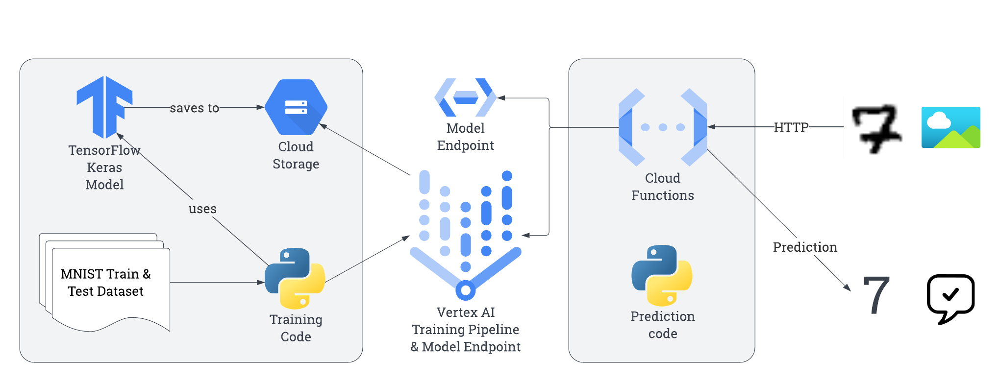

# Hello, MNIST

Objective: train, deploy, and get online predictions from a TensorFlow model to recognize handwritten digits.

The deployed project provides a Cloud Function that accepts base64-encoded images of digits and returns the predicted digits.

See also: [MNIST Database](https://en.wikipedia.org/wiki/MNIST_database)



## Tasks

### TLDR

Install dependencies & create cloud project + bucket in a region (important! example: us-west1).

Export appropriate environment variables: `CLOUD_BUCKET_NAME`, `CLOUD_PROJECT`, `CLOUD_LOCATION`.

```
gcloud config set project $CLOUD_PROJECT

# 1. Upload the custom training code
cd training-code
./upload-training-code.sh

# 2. Create the Vertex AI training pipeline using Cloud Console.
# This will take a few minutes. When complete, deploy the Vertex
# AI Model to an Endpoint and note the endpoint id. Export the
# endpoint ID to the environment as CLOUD_ENDPOINT_ID

# 3. Upload the prediction function
cd ../prediction-function
./deploy.sh

# 4. Get predictions
cd ..
./get-predictions.py sample-images/sample-digit*
```

### Setup

You need a python 3 environment with at least these dependencies:

```
pip install google-cloud-functions
pip install functions-framework
pip install tensorflow
pip install google-cloud-aiplatform
pip install pillow
pip install jupyterlab
```

Create a Cloud project, then a Storage bucket. Make sure the bucket is in a specific region (eg `us-west1`).

Put the following into the `.envrc` file, adjusting appropriately:

```
export CLOUD_STORAGE_BUCKET=david-test20230621
export CLOUD_PROJECT=dchaley-2023-06-21-tensorflow
export CLOUD_LOCATION=us-west1
```

### Train a Tensorflow model on the MNIST dataset

The notebook in `training-notebook`(adapted from [this TensorFlow sample](https://colab.research.google.com/github/tensorflow/docs/blob/4d512c2d7c40d69fcb842978aeaa136e19abe2bb/site/en/tutorials/quickstart/beginner.ipynb)) demonstrates the end-to-end process of:

1. Creating & training a model from the MNIST data
2. Writing test data to an image file and reading it back
3. Classify aka "predict" the saved image file

To create a Vertex AI model, follow these steps. (Make sure .envrc is loaded)

First, upload the "custom training code" which creates & fits the model using our TensorFlow code.

```
cd training-code
./upload-training-code.sh
```

Then create a [training pipeline](https://console.cloud.google.com/vertex-ai/training/training-pipelines).

1. Training method: defaults. (Make sure 'Custom training' is selected)
2. Model details. Pick a name. (E.g. MNIST)
3. Training container. Use TensorFlow 2.1. The package location is `gs://$CLOUD_STORAGE_BUCKET/training/trainer-0.1.tar.gz`. The python module is `trainer.task`. The model output directory is `gs://$CLOUD_STORAGE_BUCKET/trained-models/`.
4. Hyperparameters. Don't enable.
5. Compute & pricing. Pick your region, and a machine type. I used `n1-standard-4`, the smallest available.
6. Prediction container. Use a pre-built container. It should prepopulate appropriate values.

Click Start Training and wait a while.

### Deploy model to a Vertex AI endpoint for predictions

See also [these docs](https://cloud.google.com/vertex-ai/docs/general/deployment).

Once the the training pipeline completes, the model is available. To use it "as a service" we need to set up an endpoint.

I used default parameters, and chose the smallest 'standard' machine type (n1-standard-2).

Once the endpoint deploys, fetch the endpoint ID from the sample request and put in `.envrc`.

```
export CLOUD_ENDPOINT_ID=2493384508540190720
```

Now, we can get online predictions:

```
$ ./get-prediction.py training-notebook/mnist-test-img-0.png
Prediction(predictions=[[-7.2741375, -8.51450443, -1.42691994, 0.146827221, -14.4964466, -5.78822708, -17.5060711, 11.9577522, -5.4256196, -3.20187664]], deployed_model_id='5989409272402804736', model_version_id='1', model_resource_name='projects/931107229183/locations/us-west1/models/9028318674087313408', explanations=None)
7
```

### Deploy a cloud function to identify uploaded images

Our cloud function takes a list of base64 encoded image files, and runs them through the model.

To deploy the function, make sure your .envrc is loaded as above.

Deploy the function:

```
cd prediction-function
./deploy.sh
```

To call the function, send it a json object like this:

```
{
    "b64_images": [
        "base64string",
        "another_b64",
        "etc64"
    ]
}
```

For example, using gcloud and the shell:

```
gcloud functions call handler --region $CLOUD_LOCATION --data "{\"b64_images\": [\"`cat sample-images/sample-digit7-example3.png| base64 -w 0`\"]}"
```

See also [prediction README](prediction-function/README.md) for local development.

### Get predictions from the command line

Helper to call the cloud function, passing in images from the command line.

```
./get-predictions.py <filenames>
```

for example, to generate a prediction for every sample image:

```
./get-prediction.py sample-images/sample-digit*
```

Output:

```
[0, 0, 0, 0, 0, 0, 0, 0, 0, 0, 0, 0, 0, 0, 0, 1, 1, 1, 1, 1, 1, 1, 1, 1, 1, 1, 1, 1, 1, 1, 2, 2, 1, 2, 2, 2, 2, 2, 2, 2, 2, 2, 2, 2, 2, 3, 3, 0, 3, 3, 3, 3, 3, 3, 3, 3, 3, 3, 3, 3, 4, 4, 4, 4, 9, 9, 4, 8, 4, 4, 4, 4, 4, 4, 4, 5, 5, 5, 5, 5, 5, 5, 5, 5, 5, 5, 5, 5, 5, 5, 6, 6, 6, 6, 6, 6, 6, 6, 6, 6, 6, 6, 6, 6, 6, 8, 7, 7, 7, 7, 7, 7, 7, 7, 7, 7, 7, 7, 7, 7, 8, 8, 8, 8, 8, 8, 8, 8, 8, 8, 8, 8, 8, 8, 8, 9, 9, 9, 9, 9, 9, 9, 9, 9, 9, 9, 9, 9, 9, 9]
```

To test correctness, try something like this:

```
correct = sum(map(lambda x: [x] * 15, range(10)), [])
result = [0, 0, 0, 0, 0, 0, 0, 0, 0, 0, 0, 0, 0, 0, 0, 1, 1, 1, 1, 1, 1, 1, 1, 1, 1, 1, 1, 1, 1, 1, 2, 2, 1, 2, 2, 2, 2, 2, 2, 2, 2, 2, 2, 2, 2, 3, 3, 0, 3, 3, 3, 3, 3, 3, 3, 3, 3, 3, 3, 3, 4, 4, 4, 4, 9, 9, 4, 8, 4, 4, 4, 4, 4, 4, 4, 5, 5, 5, 5, 5, 5, 5, 5, 5, 5, 5, 5, 5, 5, 5, 6, 6, 6, 6, 6, 6, 6, 6, 6, 6, 6, 6, 6, 6, 6, 8, 7, 7, 7, 7, 7, 7, 7, 7, 7, 7, 7, 7, 7, 7, 8, 8, 8, 8, 8, 8, 8, 8, 8, 8, 8, 8, 8, 8, 8, 9, 9, 9, 9, 9, 9, 9, 9, 9, 9, 9, 9, 9, 9, 9]

percent_correct = [result[x] == correct[x] for x in range(len(correct))].count(True) / len(correct)
print(percent_correct)
```

