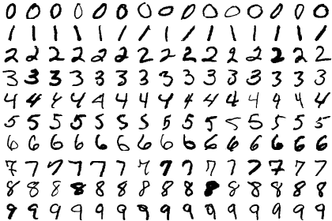

## Process

Manually remove spacing in `MnistExamplesModified.png`. To go from this:


to this:



Then run the image extractor:

```
./extract-images.py MnistExamplesModified-Squished.png
```

This results in image files following the template: `sample-digit<DIGIT>-example<EXAMPLE>.png` eg: `sample-digit5-example4.png`

## Acknowledgments

Source file `MnistExamplesModified.png` from [Wikipedia](https://en.wikipedia.org/wiki/File:MnistExamplesModified.png)

